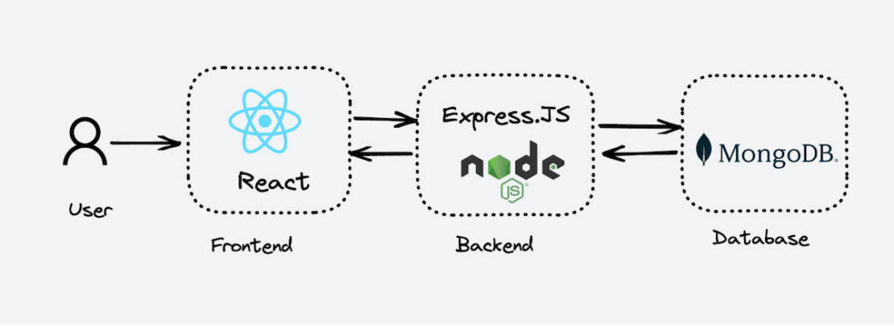

# STACK MERN MongoDB, Express.js, React.js, Node.js

A stack MERN (MongoDB, Express.js, React.js, Node.js) oferece uma solução abrangente para o desenvolvimento web, unificando JavaScript em todas as camadas, promovendo reutilização eficiente de código, agilizando o desenvolvimento, suportando a criação de Single Page Applications (SPAs), e proporcionando escalabilidade através do MongoDB. Com arquiteturas baseadas em componentes, comunidades ativas e uma abundância de ferramentas, a stack MERN é uma escolha popular para desenvolvedores que buscam consistência, eficiência e modernidade em seus projetos web.

