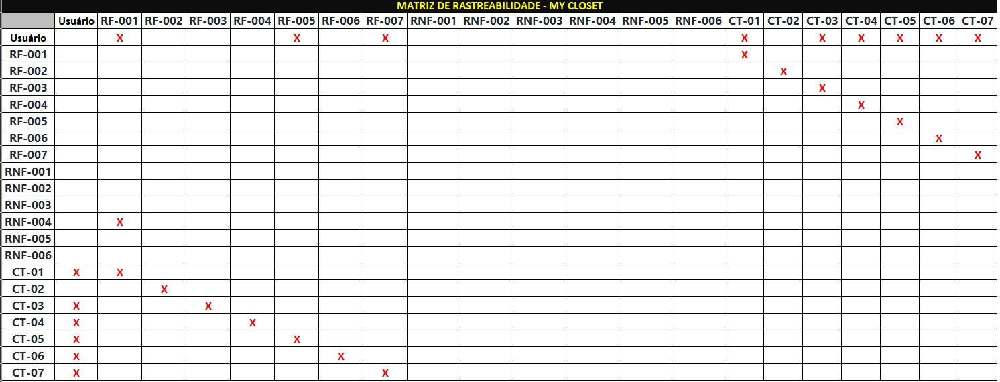
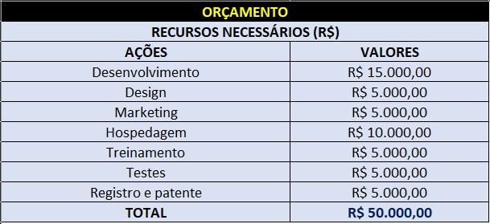

# Especificações do Projeto

Pré-requisitos: <a href="1-Documentação de Contexto.md"> Documentação de Contexto</a>

A definição dos problemas e necessidades detectados para idealizar esse projeto, advém principalmente de trabalhos de imersão feitos pelos integrantes do grupo. Foram feitas pesquisas através de artigos, reportagens, vídeos e conversas com pessoas que se encaixam no perfil do público-alvo;

## Personas

Personas - As personas levantadas durante o processo de entendimento do problema são apresentadas no quadro a seguir.

|PERSONA 1                                  |                                         |                                        |
|-------------------------------------------|-----------------------------------------|----------------------------------------|
|Nome: Joana                                |Características:                         | Aplicativos:                           |
|Estado civil: Solteira                     |Sonhadora                                |CapCut                                  |
|Idade: 22 anos                             |Calma;                                   |Canvas                                  |
|Ocupação: Mestrado na área de Arquitetura  |Dedicada;                                |Instagram                               |
|Salário: 2.500,00                          |Comprometida;                            |Twitter                                 |
|Estado civil: Solteira                     |Vegana;                                  |Pinterest                               |
|                                           |Feminista;                               |                                        |
|Hobbies:                                   |Minimalista;                             |Frustrações:                            |
|Fazer trilha;                              |Engajada em causas sociais;              |Consumismo exacerbado;                  |
|Ler;                                       |Adora animais de estimação e a natureza. |Descaso com a natureza e o planeta;     |
|Ouvir Música;                              |                                         |Capitalismo Desenfreado;                |
|Cozinhar.                                  |Valores/Crenças:                         |Não conseguir fazer mais pelo planeta.  |
|                                           |Acredita em preservação ambiental;       |                                        |
|                                           |preservação ambiental;                   |Motivações:                             |
|                                           |Consome somente o necessário;            |Ser uma pessoa melhor a cada dia;       |
|                                           |Acredita que menos é mais                |Ajudar as pessoas e o planeta;          |
|                                           |                                         |Criar projetos de moradias sustentáveis |

|Persona 2                                  |                                         |                                        | 
|-------------------------------------------|-----------------------------------------|----------------------------------------|
|Nome: Laura                                |Características:                         |Aplicativos:
|Idade: 29 anos                             |Extrovertida;                            |Instagram                          
|Ocupação: Médica                           |Determinada;                             |Twitter
|Salário: 12.000,00                         |Independente;                            |Linkedin
|Estado civil: Noiva                        |Consumista (mas quer melhorar);          |Pinterest
|Salário: 12.000,00                         |Focada na carreira;                      |Mojo
|                                           |Não quer ter filhos;                     |
|                                           |                                         |
|Hobbies:                                   |Valores/Crenças:                         |Frustrações:                                
|Ler;                                       |É leal a ela mesma e aos seus objetivos; |É  muito perfeccionista e isso acaba atrapalhando um pouco; 
|Sair com as amigas;                        |Quem não vai à luta perde a batalha.     |Não abriu seu próprio consultório ainda
|Conhecer bons restaurantes;                |Acredita que o sucesso só depende  do trabalho     |Não ter conseguido fazer uma especialização internacional;
|Comprar roupas, bolsas e sapatos.          |                                         |
|Viajar;                                    |                                         |
|                                           |                                         |
|                                           |                                         |Motivações: 
|                                           |                                         |Ser uma profissional extremamente bem sucedida;
|                                           |                                         |Ajudar muitos pacientes através do seu trabalho;
|                                           |                                         |Comprar uma casa linda e se casar;
|                                           |                                         |Tentar ser um pouco menos consumista.

|Persona 3                       |                              |                                      |
|--------------------------------|------------------------------|--------------------------------------------|
|Nome: Clara                     | Características:             |Aplicativos: |
|Idade: 32 anos                  | Trabalha muito;              |Revistas de modas;
|Ocupação: Empresária (empresa de consultoria de imagem)| Determinada; |Instagram;
|Salário: Entre 20.000,00 e 30.000,00|Muito apaixonada pela família,|Pinterest;
|Estado civil: Casada com um filho.|Dedicada;|
|                                  |Detalhista;|                                                                                                                       |                                  |                                                    
|Hobbies:                          |
|Viajar;                           |Valores/Crenças: |  Frustrações:           
|Correr;                           |Você deve ser vestir para o cargo que deseja alcançar;|Não poder aumentar a família;
|Sair para teatros e museus;       |Trabalhar é servir e isso é o que move o ser humano;|Morar longe dos pais;             
|Ficar com a família;              |Todo meu esforço é pela minha família.|Dificuldade de empreender no país
|Cozinhar;                         | A família é a base do sucesso.|
|Ler;                              |Acredita que a aparência importa 
|                                  | |
|                                 || Motivações: 
|                                  ||Ter uma família feliz e unida;
|                                  ||Ajudar mulheres a se sentirem mais bonitas, valorizadas e poderosas através do seu trabalho.
|                                  ||Ser bem sucedida;
|                                  ||Comprar uma casa no campo;

## Histórias de Usuários

A partir da compreensão do dia a dia das personas identificadas para o projeto, foram registradas as seguintes histórias de usuários.

|EU COMO... `PERSONA`| QUERO/PRECISO ... `FUNCIONALIDADE` |PARA ... `MOTIVO/VALOR`                 |
|--------------------|------------------------------------|----------------------------------------|
|Joana | fazer uso das funcionalidades do app para catalogar todas as minhas peças de roupas, sapatos e acessórios |criar mais  combinações de looks, mesmo com poucas peças|
|Joana | fazer uso das funcionalidades do app para ter um estilo próprio e autêntico, mas sem cair na armadilha do consumo desenfreado | de forma criativa e consciente, fugir das amarras do consumismo. promovendo um mundo mais equilibrado no âmbito ambiental e pessoal|
|Joana| fazer uso das funcionalidades do app para diminuir meu consumo de roupas descartáveis e desnecessárias | promover um estilo de vida mais minimalista e sustentável|
|Laura | fazer uso das funcionalidades do app para adotar uma mentalidade minimalista em relação à moda com foco nas roupas que realmente preciso, coibindo assim compras impulsivas | reduzir o consumo de peças de roupas novas e investir em peças de qualidade, com maior durabilidade e versatilidade |
|Laura| fazer uso das funcionalidades do app para catalogar peças velhas, gastas | reparar itens danificados e doar a terceiros|
|Laura|fazer uso das funcionalidades do app para rastrear peças e acessórios em desuso | trocar e assim adquirir peças multifuncionais e ecológicas|
|Clara|fazer uso das funcionalidades do app ter mais praticidade, agilidade e foco na vestimenta da ocasião |assessoria visual na montagem de looks diários|
|Clara|fazer uso das funcionalidades do app priorizar o consumo e novas aquisições de peças mais duráveis |evitar o consumo de produtos sintéticos e de difícil decomposição |
|Clara|fazer uso das funcionalidades do app e organizar o meu closet por segmento de uso (descolado, empresarial, moda praia, inverno, etc) |evitar compras de itens que já possuo, bem como itens que não combine com o que já tenho|

## Modelagem do Processo de Negócio 

### Análise da Situação Atual

Apresente aqui os problemas existentes que viabilizam sua proposta. Apresente o modelo do sistema como ele funciona hoje. Caso sua proposta seja inovadora e não existam processos claramente definidos, apresente como as tarefas que o seu sistema pretende implementar são executadas atualmente, mesmo que não se utilize tecnologia computacional. 

### Descrição Geral da Proposta

Apresente aqui uma descrição da sua proposta abordando seus limites e suas ligações com as estratégias e objetivos do negócio. Apresente aqui as oportunidades de melhorias.

### Processo 1 – NOME DO PROCESSO

Apresente aqui o nome e as oportunidades de melhorias para o processo 1. Em seguida, apresente o modelo do processo 1, descrito no padrão BPMN. 

### Processo 2 – NOME DO PROCESSO

Apresente aqui o nome e as oportunidades de melhorias para o processo 2. Em seguida, apresente o modelo do processo 2, descrito no padrão BPMN.

## Indicadores de Desempenho

**Indicador**|**Objetivo**|**Descrição**|**Fonte e Dados**|**Perspectiva**
:-----:|:-----:|:-----:|:-----:|:-----:
Taxa de Utilização do Closet Online|Estimular a inserção de peças no closet online|Percentual de peças de roupas cadastradas|Banco de Dados de Peças|Interna
Taxa de Uso da Funcionalidade de Montagem de Looks|Avaliar a utilidade da funcionalidade|Percentual de usuários que utilizaram a funcionalidade|Registro de Atividades|Cliente
Taxa de Interação com Listas (Doação e Compras)|Avaliar a utilização das listas|Percentual de usuários que criaram ou interagiram com listas|Registro de Atividades|Cliente
Taxa de Sucesso em Adicionar/Excluir Peças|Verificar a eficiência das ações|Percentual de ações de adição/exclusão de peças bem-sucedidas|Registro de Atividades|Interna
Taxa de Sucesso de Login|Monitorar a eficiência de login|Percentual de logins bem-sucedidos|Registro de Atividades|Interna

## Requisitos

A fase inicial do desenvolvimento de um software passa pela definição e elaboração de seus requisitos funcionais, que apresentam as possibilidades de interação entre o usuário e o programa, bem como a definição de seus requisitos não funcionais que são aqueles que norteiam os aspectos que o sistema deve apresentar de qualidade e construção. Ambos serão apresentados a seguir. 

### Requisitos Funcionais

A Tabela a seguir apresenta os requisitos funcionais do projeto, bem como suas prioridades de desenvolvimento e entrega.

|ID    | Descrição do Requisito                                                                                     |Prioridade|
|------|------------------------------------------------------------------------------------------------------------|----------|
|RF-001| Permitir que o usuário cadastre peças de roupas.                                                           |   ALTA   | 
|RF-002| Os usuários devem poder cadastrar informações sobre suas roupas, como nome, categoria, cor, tamanho e marca|   MÉDIA  |
|RF-003| Os usuários podem adicionar uma foto da roupa ao cadastrá-la.                                              |   ALTA   | 
|RF-004| O cadastro de roupas deve ser intuitivo e fácil de completar.                                              |   MÉDIA  |
|RF-005| Os usuários devem poder criar looks combinando diferentes peças de roupa do seu guarda-roupa.              |   ALTA   | 
|RF-006| Os usuários podem marcar roupas como favoritas para fácil acesso posterior.                                |   ALTA   | 
|RF-007| Haverá uma seção específica onde os itens favoritos podem ser visualizados.                                |   ALTA   | 
|RF-008| Os usuários podem adicionar roupas à lista de doações, indicando quais itens desejam doar.                 |   MÉDIA  |
|RF-009| Os usuários podem filtrar suas roupas por categorias (por exemplo, camisetas, calças, vestidos, etc.).     |   ALTA   | 
|RF-010| Os usuários devem poder editar as informações das roupas cadastradas                                       |   ALTA   | 
|RF-011| Os usuários também devem poder remover roupas do guarda-roupa.                                             |   ALTA   | 

### Requisitos não Funcionais

A tabela a seguir apresenta então os requisitos não funcionais do projeto, apresentando também as prioridades quanto ao desenvolvimento e entrega.

|ID     | Descrição do Requisito                                                                                                                                               |Prioridade |
|-------|----------------------------------------------------------------------------------------------------------------------------------------------------------------------|-----------|
|RNF-001| O sistema deve ser desenvolvido na linguagem React Native.                                                                                                           |   MÉDIA   | 
|RNF-002| O aplicativo deve responder de forma rápida e suave aos comandos do usuário, minimizando atrasos e travamentos.                                                      |   MEDIA   | 
|RNF-003| A interface do usuário deve ser intuitiva e de fácil compreensão, permitindo que os usuários interajam com o aplicativo sem dificuldades.                            |   ALTA    |
|RNF-004| Dados pessoais dos usuários, como informações de login e detalhes do guarda-roupa, devem ser protegidos por meio de criptografia e práticas seguras de armazenamento.|   ALTA    |
|RNF-005| O código-fonte do aplicativo deve ser organizado de forma modular e reutilizável para facilitar a manutenção e futuras atualizações.                                 |   MEDIA   |

## Restrições

O projeto está restrito pelos itens apresentados na tabela a seguir.

|ID   | Restrição                                                                 |
|-----|---------------------------------------------------------------------------|
|RE-01| O projeto deverá ser entregue até a data limite.                          |
|RE-02| O aplicativo se restringe à linguagem c# back-end.                        |
|RE-03| A equipe do projeto não poderá subcontratar o desenvolvimento do projeto. |

Enumere as restrições à sua solução. Lembre-se de que as restrições geralmente limitam a solução candidata. (Vinicius ficou com essa parte, porém não fez).

## Diagrama de Casos de Uso

# Matriz de Rastreabilidade

A matriz de rastreabilidade é uma ferramenta usada para facilitar a visualização dos relacionamento entre requisitos e outros artefatos ou objetos, permitindo a rastreabilidade entre os requisitos e os objetivos de negócio. 

A matriz abaixo contempla todos os elementos relevantes e suas conexões que fazem parte do aplicativo My Closet:

# Gerenciamento de Projeto

De acordo com o PMBoK v6 as dez áreas que constituem os pilares para gerenciar projetos, e que caracterizam a multidisciplinaridade envolvida, são: Integração, Escopo, Cronograma (Tempo), Custos, Qualidade, Recursos, Comunicações, Riscos, Aquisições, Partes Interessadas. Para desenvolver projetos um profissional deve se preocupar em gerenciar todas essas dez áreas. Elas se complementam e se relacionam, de tal forma que não se deve apenas examinar uma área de forma estanque. É preciso considerar, por exemplo, que as áreas de Escopo, Cronograma e Custos estão muito relacionadas. Assim, se eu amplio o escopo de um projeto eu posso afetar seu cronograma e seus custos.

## Gerenciamento de Tempo

## Gerenciamento de Equipe

## Gestão de Orçamento

O processo de determinar o orçamento do projeto é uma tarefa que depende, além dos produtos (saídas) dos processos anteriores do gerenciamento de custos, também de produtos oferecidos por outros processos de gerenciamento, como o escopo e o tempo.

