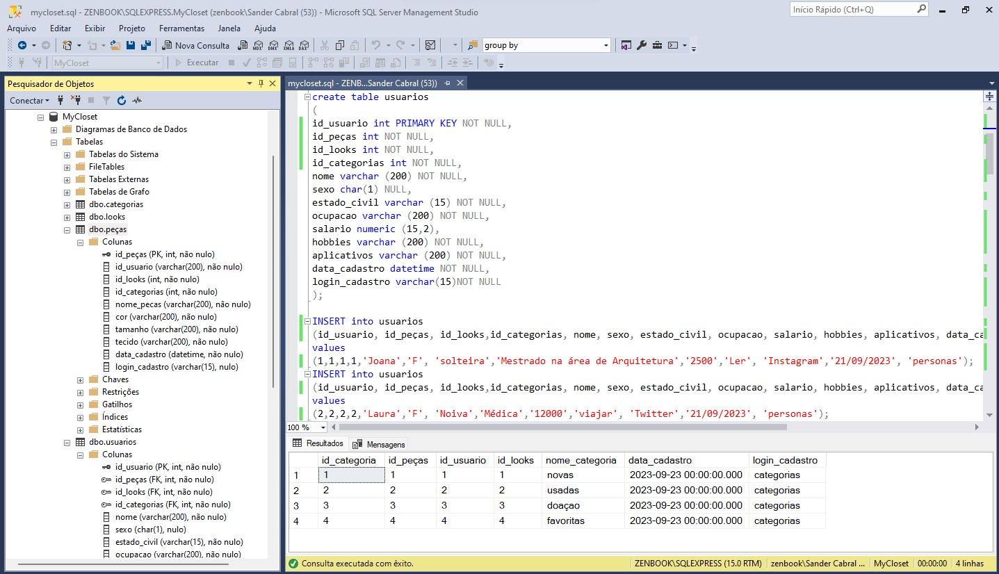

# Arquitetura da Solução

Pré-requisitos: <a href="3-Projeto de Interface.md"> Projeto de Interface</a>

Definição de como o software é estruturado em termos dos componentes que fazem parte da solução e do ambiente de hospedagem da aplicação.

## Diagrama de Classes

O diagrama de classes ilustra graficamente como será a estrutura do software, e como cada uma das classes da sua estrutura estarão interligadas. Essas classes servem de modelo para materializar os objetos que executarão na memória.

## Modelo ER

Um diagrama de entidade-relacionamento (DER) é uma representação visual que descreve a estrutura de um sistema de banco de dados ou as relações entre entidades (tabelas) dentro desse sistema. Ele usa símbolos gráficos para representar entidades, atributos e os relacionamentos entre entidades. O principal objetivo de um DER é modelar como os dados são organizados e inter-relacionados em um banco de dados, proporcionando uma visão clara das entidades envolvidas e suas conexões.  É amplamente utilizado em engenharia de software e gerenciamento de banco de dados para planejar, projetar e documentar sistemas de informações complexos.

## Esquema Relacional

O Esquema Relacional corresponde à representação dos dados em tabelas juntamente com as restrições de integridade e chave primária.

 
## Modelo Físico

Entregar um arquivo banco.sql contendo os scripts de criação das tabelas do banco de dados. Este arquivo deverá ser incluído dentro da pasta src\bd.

* scrip anexado (pasta src\bd) - pmv-ads-2023-2-e3-proj-mov-t4-2023-e3-projmovt4-time2-myclosetweb/ src/ ativos
/meucloset.sql
  
## Tecnologias Utilizadas

### Front-End:

1. **HTML/CSS/JavaScript:** Essas são as bases para o desenvolvimento da interface do usuário.

2. **Frameworks de JavaScript:** Frameworks como React Native, Node.js e Expo-CLI são frequentemente usados para criar interfaces de usuário interativas.

3. **Design Responsivo:** Para garantir que o aplicativo seja acessível em dispositivos móveis, tablets e desktops.

4. **UI/UX Design:** Ferramentas de design como Lucidchart, Figma, Canva e InVision são usadas para criar designs de interface do usuário.

### Back-End:

5. **Linguagem de Programação:** A escolha da linguagem de programação pode variar, mas linguagens populares incluem Python, Node.js (JavaScript), Java ou PHP.

6. **Frameworks de Desenvolvimento:** Frameworks como Ruby on Rails, Django (Python), Express.js (Node.js) ou Spring (Java) podem acelerar o desenvolvimento.

7. **Banco de Dados:** Tecnologias de banco de dados relacionais como SQL Server Management Studio (SSMS) são usadas para armazenar dados.

8. **APIs:** Para integrações com serviços de terceiros, como sistemas de pagamento e sistemas de entrega, etc.

### Desenvolvimento Móvel (se aplicável):

9. **Plataformas Móveis:** Para desenvolvimento de aplicativos móveis, você pode usar o Android Studio (para Android) ou Xcode (para iOS).

10. **Frameworks Mobile:** Para desenvolvimento multiplataforma, você pode usar React Native, Flutter ou Xamarin.

### Tecnologias Inteligentes:

11. **Servidores Web:** Para hospedar seu aplicativo, você pode usar serviços de hospedagem na nuvem como AWS, Google Cloud, Azure ou hospedagem compartilhada.

### Sistemas de Controle de Versão:

12. Ferramentas como Git e GitHub são essenciais para gerenciar o código-fonte.

### Segurança:

13. Implementar práticas de segurança, como autenticação de usuário, autorização, criptografia de dados e prevenção de ataques.

### Testes e QA:

14. Ferramentas de teste e controle de qualidade, como Jest, Selenium, ou ferramentas de automação de teste.

### Monitoramento e Analytics:

15. Ferramentas para monitorar o desempenho do aplicativo e coletar dados de uso, como Google Analytics ou Firebase Analytics.

## Hospedagem

Explique como a hospedagem e o lançamento da plataforma foi feita.

> **Links Úteis**:
>
> - [Website com GitHub Pages](https://pages.github.com/)
> - [Programação colaborativa com Repl.it](https://repl.it/)
> - [Getting Started with Heroku](https://devcenter.heroku.com/start)
> - [Publicando Seu Site No Heroku](http://pythonclub.com.br/publicando-seu-hello-world-no-heroku.html)

## Qualidade de Software

A norma ISO 9126 é uma norma internacional que define um conjunto de características e subcaracterísticas para a avaliação da qualidade de software.  A escolha específica de características e subcaracterísticas dependerá das necessidades e objetivos do projeto de software.

imagem da tabela de qualidade de software](https://github.com/ICEI-PUC-Minas-PMV-ADS/pmv-ads-2023-2-e3-proj-mov-t4-2023-e3-projmovt4-time2-myclosetweb/blob/main/docs/img/Qualidade%20de%20Softwere-1.png)

## Requisitos de Qualidade

### Funcionalidade

- **Adequação:** Fornecer uma variedade de funções para organização de guarda-roupa.
- **Acurácia:** Alto grau de precisão na exibição de informações sobre roupas e conjuntos.
- **Interoperabilidade:** Compatibilidade com Android, iOS e versão web.
- **Segurança:** Criptografia dos dados pessoais e autenticação do usuário.
- **Conformidade:** Conformidade com as leis de proteção de dados e outras regulamentações.

### Usabilidade

- **Inteligibilidade:** Design intuitivo para fácil navegação.
- **Apreensibilidade:** Inclusão de tutoriais ou guias para auxiliar novos usuários.
- **Operabilidade:** Facilidade de uso com controles bem projetados, como filtros e recursos de busca.
- **Atratividade:** Design visualmente agradável, com uma paleta de cores apropriada.
- **Conformidade:** Adesão às melhores práticas e padrões da indústria para design de UI/UX.

